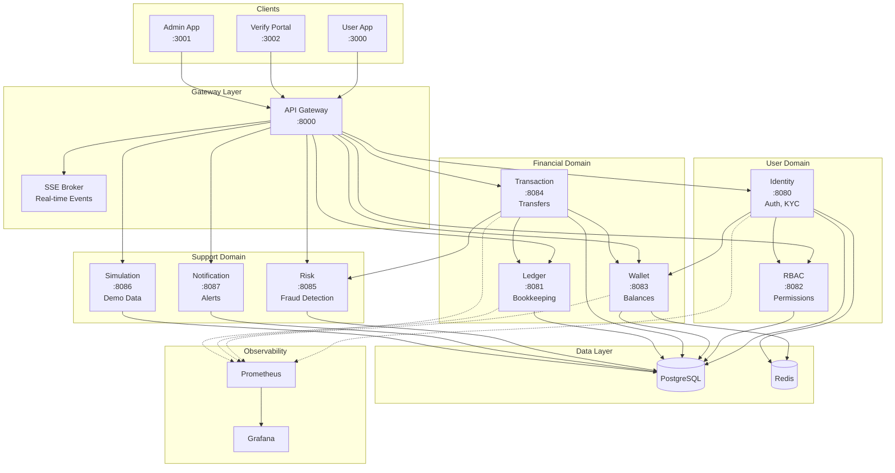
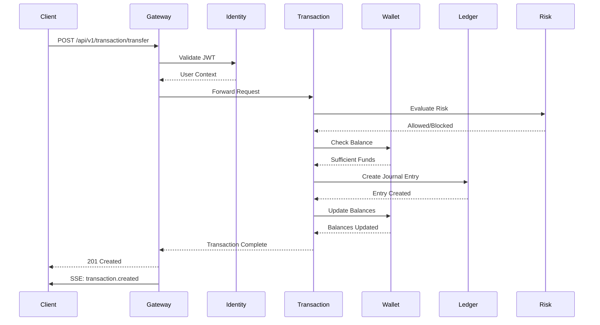

# System Architecture
{: .no_toc }

High-level architecture overview of the Nivo neobank platform.
{: .fs-6 .fw-300 }

---

## Table of Contents
{: .no_toc .text-delta }

1. TOC
{:toc}

---

## Overview

Nivo is built as a microservices architecture with clear domain boundaries. Each service is responsible for a specific business capability and communicates through well-defined APIs.



### Service Communication Flow



---

## Services

### Gateway (Port 8000)

The API Gateway is the single entry point for all client requests.

**Responsibilities:**
- Route requests to appropriate backend services
- Transform paths (strip service name from URL)
- Add forwarding headers (X-Forwarded-*, X-Real-IP)
- Handle CORS
- Aggregate SSE events from services

**Path Transformation:**
```
Client: POST /api/v1/identity/auth/login
Gateway: POST /api/v1/auth/login → Identity Service
```

---

### Identity Service (Port 8080)

Handles user authentication, registration, and KYC management.

**Key Features:**
- User registration with email/phone validation
- Password hashing with bcrypt
- JWT token generation and validation
- KYC document submission and status tracking
- Profile management

**Database Tables:**
- `users` - User accounts
- `user_kyc` - KYC submissions and status
- `sessions` - Active sessions

---

### Ledger Service (Port 8081)

Implements double-entry bookkeeping for all financial transactions.

**Key Features:**
- Chart of accounts management
- Journal entry creation
- Balance calculations
- Account statements
- Audit trail

**Double-Entry Principle:**
Every transaction creates balanced entries:
```
Debit Entry  (Asset increases)  = Credit Entry (Liability/Equity increases)
Total Debits                    = Total Credits
```

---

### RBAC Service (Port 8082)

Role-Based Access Control for fine-grained permissions.

**Key Features:**
- Role management (admin, user, support)
- Permission definitions
- User-role assignments
- Permission checking

**Default Roles:**
- `super_admin` - Full system access
- `admin` - Administrative functions
- `support` - Limited admin access
- `user` - Standard user permissions

---

### Wallet Service (Port 8083)

Manages user wallets and balances.

**Key Features:**
- Wallet creation per user
- Balance tracking
- Credit/debit operations
- Wallet status management (active, frozen, closed)

**Wallet States:**
```
pending → active → frozen → active
                       ↓
                    closed
```

---

### Transaction Service (Port 8084)

Orchestrates money movements between wallets.

**Key Features:**
- Deposits
- Withdrawals
- Peer-to-peer transfers
- Transaction history
- Idempotency support

**Transaction Flow:**
1. Validate request
2. Check source wallet balance
3. Create ledger entries
4. Update wallet balances
5. Record transaction

---

### Risk Service (Port 8085)

Fraud detection and risk management.

**Key Features:**
- Transaction velocity checks
- Amount limit enforcement
- Suspicious activity detection
- Risk scoring

---

### Notification Service (Port 8087)

Handles user notifications across channels.

**Key Features:**
- Email notifications (via templates)
- SMS alerts
- In-app notifications
- Notification preferences

---

### Simulation Service (Port 8086)

Generates realistic demo traffic with user personas.

**Key Features:**
- User generation
- Transaction simulation
- Demo scenario setup

---

## Data Flow

### Registration Flow

```
User → Gateway → Identity Service → PostgreSQL
                      ↓
              RBAC Service (assign default role)
```

### KYC Verification Flow

```
User submits KYC → Identity stores → Admin reviews → Status updated
                                          ↓
                           Wallet Service creates wallet (on approval)
```

### Transaction Flow

```
User Request
     ↓
Gateway → Transaction Service
               ↓
          Validate User (Identity)
               ↓
          Check Limits (Risk)
               ↓
          Get Wallet (Wallet Service)
               ↓
          Create Entry (Ledger)
               ↓
          Update Balance (Wallet Service)
               ↓
          Record Transaction
               ↓
          Publish Event (SSE)
```

---

## Technology Choices

### Why Go?

- Excellent concurrency model (goroutines)
- Fast compilation and deployment
- Strong typing with simplicity
- Great standard library for HTTP services
- Low memory footprint

### Why PostgreSQL?

- ACID compliance for financial data
- Rich SQL features (CTEs, window functions)
- JSON support for flexible schemas
- Strong ecosystem and tooling

### Why Microservices?

- Independent deployment and scaling
- Clear domain boundaries
- Technology flexibility per service
- Team autonomy

### Why JWT?

- Stateless authentication
- Can embed claims (user_id, roles)
- Standard format, wide library support
- Works well with microservices

---

## Security Considerations

### Authentication
- Passwords hashed with bcrypt (cost 12)
- JWTs with short expiration (24h)
- Refresh token rotation

### Authorization
- RBAC for permission management
- Service-level JWT validation
- Resource-level ownership checks

### Data Protection
- TLS for all external communication
- Input validation at all endpoints
- SQL injection prevention (parameterized queries)

---

## Observability

### Logging
- Structured JSON logging (zerolog)
- Correlation IDs across services
- Request/response logging

### Metrics
- Prometheus metrics on all services (`/metrics` endpoint)
- Grafana Mission Control dashboard
- RED metrics (Request rate, Error rate, Duration)
- Service health endpoints (`/health`)

### Tracing (Future)
- Distributed tracing with Jaeger/Zipkin
- Request flow visualization

---

## Future Architecture

### Planned Enhancements

1. **Distributed Tracing**
   - Jaeger integration
   - Request flow visualization
   - Performance bottleneck identification

2. **Message Queue**
   - Async notification delivery
   - Event sourcing for audit logs
   - Service decoupling

3. **API Gateway Enhancements**
   - Rate limiting per user
   - Request/response transformation
   - Circuit breaker pattern

---

## Architecture Decision Records (ADRs)

Key architectural decisions are documented in formal ADRs with full context, alternatives considered, and consequences:

| ADR | Decision | Summary |
|:----|:---------|:--------|
| [ADR-001](/adr/001-double-entry-ledger) | **Double-Entry Ledger** | Financial accuracy through balanced transactions. Every debit has a corresponding credit, ensuring audit trail integrity. |
| [ADR-002](/adr/002-jwt-rbac-authorization) | **JWT + RBAC** | Stateless authentication with role-based access control. Scales horizontally without shared session state. |
| [ADR-003](/adr/003-microservices-architecture) | **Microservices Architecture** | Domain-driven service boundaries enable independent scaling and deployment. Shared database for MVP simplicity. |

**Additional Decisions:**

| Decision | Rationale |
|:---------|:----------|
| **PostgreSQL (Single DB)** | Simplicity for MVP. Services share database but use separate tables. Migration to per-service DBs documented as future enhancement. |
| **Go for Services** | Strong concurrency, fast builds, excellent HTTP stdlib. Good fit for microservices with high request throughput. |
| **India-Centric Design** | INR currency (amounts in paise), PAN/Aadhaar KYC validation, UPI payment simulation. |

{: .highlight }
> See the full [Architecture Decision Records](/adr) for detailed context, alternatives considered, and trade-offs.
