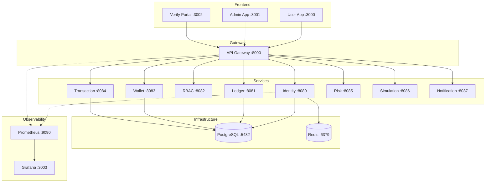

# Nivo Quick Start Guide

## Prerequisites

- Go 1.24 or later
- Docker and Docker Compose
- Make

## Quick Start with Docker Compose

### 1. Start All Services

```bash
# Start all infrastructure and services
make docker-up
```

This will start:
- **PostgreSQL** (port 5432) - Database
- **Redis** (port 6379) - Caching
- **All 9 microservices** (ports 8080-8087) - Backend services
- **API Gateway** (port 8000) - Request routing
- **Prometheus** (port 9090) - Metrics (internal)
- **Grafana** (port 3003) - Monitoring dashboard

### 2. Check Service Health

```bash
# Check Identity Service
curl http://localhost:8080/health

# Check Ledger Service
curl http://localhost:8081/health
```

### 3. View Logs

```bash
# View all logs
make docker-logs

# View specific service logs
docker compose logs -f identity-service
docker compose logs -f ledger-service
```

### 4. Stop Services

```bash
make docker-down
```

## Local Development (without Docker)

### 1. Start Infrastructure Only

```bash
# Start only PostgreSQL and Redis
docker compose up -d postgres redis
```

### 2. Build Services

```bash
# Build all services
make build

# Or build individually
make -C services/identity build
make -C services/ledger build
```

### 3. Run Services Locally

```bash
# Terminal 1 - Identity Service
make run-identity

# Terminal 2 - Ledger Service
make run-ledger
```

## Testing the Services

### Identity Service Endpoints

```bash
# Register a new user
curl -X POST http://localhost:8080/api/v1/auth/register \
  -H "Content-Type: application/json" \
  -d '{
    "email": "user@example.com",
    "password": "SecurePass123!",
    "phone": "+919876543210",
    "first_name": "John",
    "last_name": "Doe",
    "date_of_birth": "1990-01-15"
  }'

# Login
curl -X POST http://localhost:8080/api/v1/auth/login \
  -H "Content-Type: application/json" \
  -d '{
    "email": "user@example.com",
    "password": "SecurePass123!"
  }'

# Get user profile (requires JWT token from login)
curl http://localhost:8080/api/v1/users/me \
  -H "Authorization: Bearer YOUR_JWT_TOKEN"
```

### Ledger Service Endpoints

```bash
# Create a new account
curl -X POST http://localhost:8081/api/v1/accounts \
  -H "Content-Type: application/json" \
  -d '{
    "code": "1100",
    "name": "Cash Account",
    "type": "asset",
    "currency": "INR",
    "description": "Main cash account"
  }'

# Get account by ID
curl http://localhost:8081/api/v1/accounts/{account-id}

# Create a journal entry
curl -X POST http://localhost:8081/api/v1/journal-entries \
  -H "Content-Type: application/json" \
  -d '{
    "type": "standard",
    "description": "Initial deposit",
    "lines": [
      {
        "account_id": "account-id-1",
        "debit_amount": 100000,
        "credit_amount": 0,
        "description": "Cash debit"
      },
      {
        "account_id": "account-id-2",
        "debit_amount": 0,
        "credit_amount": 100000,
        "description": "Revenue credit"
      }
    ]
  }'

# List accounts
curl http://localhost:8081/api/v1/accounts

# Get account balance
curl http://localhost:8081/api/v1/accounts/{account-id}/balance
```

## Troubleshooting

### Services won't start

```bash
# Check if ports are already in use
lsof -i :8080  # Identity Service
lsof -i :8081  # Ledger Service
lsof -i :5432  # PostgreSQL

# Check Docker containers
docker compose ps

# Rebuild images
make docker-build
```

### Database migrations not running

```bash
# Check migrations directory exists
ls -la services/identity/migrations/
ls -la services/ledger/migrations/

# Check database connection
docker compose exec postgres psql -U nivo -d nivo -c "\dt"
```

### View database

```bash
# Connect to PostgreSQL
docker compose exec postgres psql -U nivo -d nivo

# List tables
\dt

# Query users
SELECT * FROM users;

# Query accounts
SELECT * FROM accounts;

# Query journal entries
SELECT * FROM journal_entries;
```

## Next Steps

Once you have the platform running:

- [Try the Demo Walkthrough](/demo) - Explore features with pre-seeded accounts
- [Read the Architecture Guide](/architecture) - Understand service boundaries
- [Explore End-to-End Flows](/flows) - See how services interact
- [View the Design System](/design-system) - Frontend component patterns

## Architecture Overview



## India-Centric Features

- **Currency**: All amounts in INR (stored in paise)
- **Timezone**: Asia/Kolkata (IST, UTC+5:30)
- **Validators**: PAN, Aadhaar, IFSC, UPI, Indian phone numbers
- **KYC**: PAN and Aadhaar verification workflow
- **Chart of Accounts**: Indian accounting standards

## Development

```bash
# Run tests
make test

# Run tests with coverage
make test-coverage

# Format code
make fmt

# Run linter (requires golangci-lint)
make lint

# Clean build artifacts
make clean
```

## Environment Variables

See `.env.example` for all configuration options. Copy it to `.env` and customize:

```bash
cp .env.example .env
```

## Support

For issues, check the logs:

```bash
# All services
make docker-logs

# Specific service
docker compose logs identity-service
docker compose logs ledger-service
```
