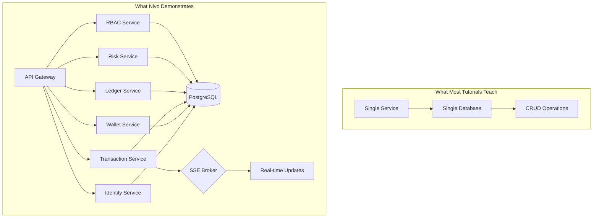
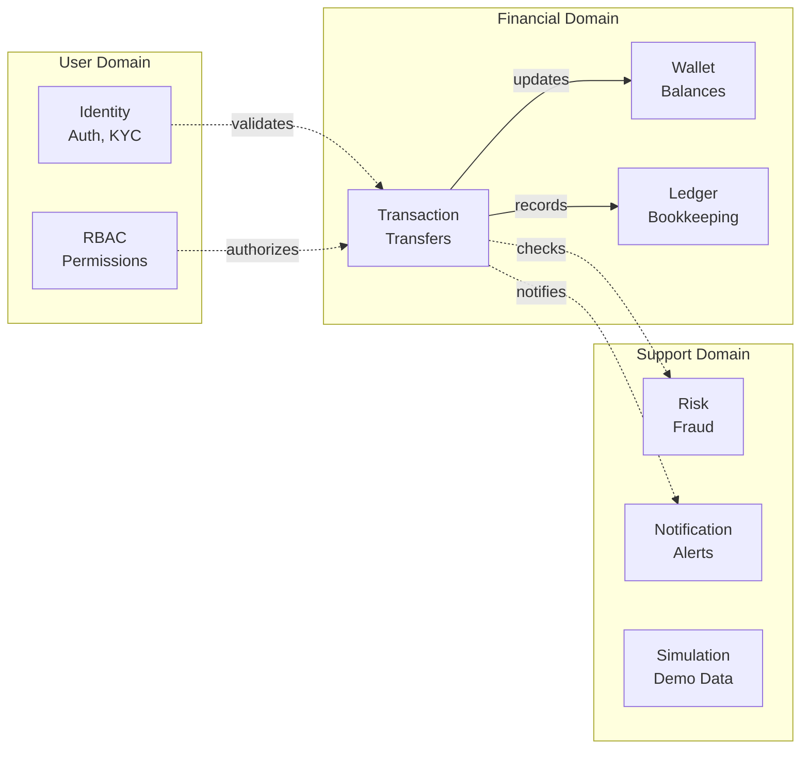
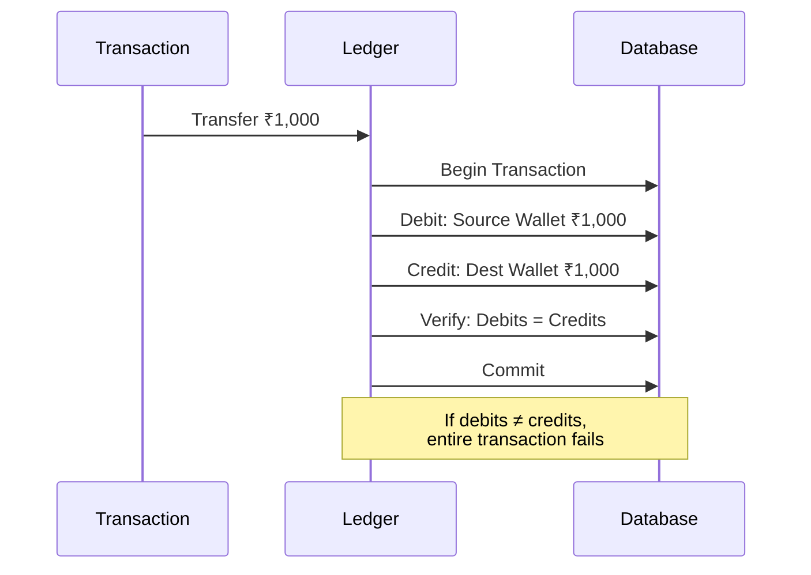
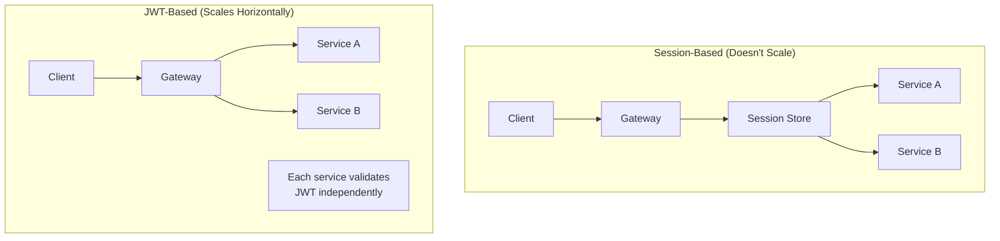

# Why Nivo?
{: .fs-9 }

Building a neobank is hard. Building one *right* is harder. This is the story of how Nivo came to be.
{: .fs-6 .fw-300 }

---

## The Problem with Portfolio Projects

Most portfolio projects fall into one of two traps:

1. **Too simple** — CRUD apps that don't demonstrate real engineering skill
2. **Too ambitious** — Half-finished projects that promise everything, deliver nothing

Nivo takes a different approach: **scope small, execute deep**.

Instead of building a complete bank (impossible), we built the core systems that make a bank work — and built them *well*.

---

## What Makes Nivo Different

### Real Domain Complexity

Fintech isn't just moving numbers around. It's about:

- **Money integrity** — Ensuring ₹1,000 can never become ₹1,001 or ₹999
- **Audit trails** — Every rupee must be traceable to its source
- **Compliance** — KYC, transaction limits, fraud detection
- **Concurrency** — Multiple transfers happening simultaneously without race conditions

Nivo implements all of these. Not as stubs or TODOs — as working systems.

### Production Patterns, Not Tutorials



Nivo demonstrates patterns you'd actually use in production:

| Pattern | Implementation |
|:--------|:---------------|
| **Double-Entry Ledger** | Every transaction creates balanced journal entries |
| **Idempotency** | Safe retries for financial operations |
| **RBAC** | Role hierarchy with granular permissions |
| **Real-time Events** | SSE for instant balance updates |
| **Service Isolation** | Each service owns its domain completely |

### India-First Design

Most fintech demos assume USD, US phone numbers, US regulations. Nivo is built for India:

- **Currency**: INR stored as paise (smallest unit)
- **KYC**: PAN and Aadhaar validation
- **Phone**: +91 format validation
- **Timezone**: IST (Asia/Kolkata)
- **UPI**: Simulated UPI deposit flow

This isn't just localization — it's demonstrating understanding of a specific market's requirements.

---

## The Architecture Story

### Why Microservices?

Not because they're trendy. Because the domains are genuinely different:



- **Identity** cares about users and authentication
- **Ledger** cares about accounting accuracy
- **Risk** cares about fraud patterns
- **Transaction** orchestrates them all

These are different concerns with different change rates. Microservices let them evolve independently.

### Why Double-Entry Bookkeeping?

Simple balance tracking seems easier:
```
wallet.balance = wallet.balance + amount
```

But what happens when:
- A bug credits an account twice?
- An admin needs to know where money came from?
- A regulator asks for a complete audit trail?

Double-entry makes these problems impossible:



Every rupee has a source. Every rupee has a destination. The books always balance.

### Why JWT + RBAC?

Sessions are simpler, but they don't scale:



With JWT:
- No shared session store
- Services validate tokens independently
- Scales to any number of instances
- Permissions embedded in token

---

## What Nivo Teaches

### For Engineers

- How to structure a Go microservices project
- How double-entry ledger systems work
- How to implement proper RBAC
- How to handle financial transactions safely
- How to build real-time features with SSE

### For Architects

- When microservices make sense (and when they don't)
- How to draw service boundaries
- How to handle cross-service transactions
- Trade-offs between consistency and availability

### For Hiring Managers

This project demonstrates:

| Skill | Evidence |
|:------|:---------|
| **System Design** | 9 services with clear boundaries |
| **Domain Knowledge** | Double-entry ledger, KYC, risk management |
| **Code Quality** | Consistent patterns across all services |
| **Production Thinking** | Idempotency, graceful shutdown, structured logging |
| **Documentation** | ADRs, flow diagrams, API docs |

---

## What Nivo Doesn't Do

Being honest about scope is as important as showing capability:

| Feature | Status | Why |
|:--------|:-------|:----|
| Real payments | Simulated | Regulatory compliance, banking licenses |
| Multi-currency | INR only | Scope control, India-first design |
| Mobile apps | Web only | Focus on backend architecture |
| High availability | Single instance | Demo scope, not production deployment |
| Event sourcing | Not implemented | Double-entry provides sufficient auditability |

These aren't limitations — they're deliberate scope decisions. A project that tries to do everything does nothing well.

---

## The Technical Journey

### Phase 1: Foundation

Core services with basic functionality:
- Identity (auth, users)
- Ledger (accounts, entries)
- Wallet (balances)
- Gateway (routing)

### Phase 2: Financial Features

Complete transaction flows:
- Deposits, withdrawals, transfers
- Risk evaluation
- Beneficiary management
- RBAC permissions

### Phase 3: Polish

Production-readiness:
- Real-time SSE events
- Simulation engine for demo data
- Admin dashboard
- Observability with Prometheus/Grafana

### Phase 4: Documentation

You're reading it. Because code without context is just text.

---

## Try It Yourself

### Live Demo

Nivo has three frontend applications, each serving a distinct purpose:

| App | URL | Purpose |
|:----|:----|:--------|
| **User App** | [nivomoney.com](https://nivomoney.com) | Customer-facing banking |
| **Verify Portal** | [verify.nivomoney.com](https://verify.nivomoney.com) | Transaction verification for paired users |
| **Admin Dashboard** | [admin.nivomoney.com](https://admin.nivomoney.com) | Operations and KYC management |

**User App** — [nivomoney.com](https://nivomoney.com)
```
Email: raj.kumar@gmail.com
Password: raj123
```
The main banking experience: dashboard, transfers, transaction history, profile management.

**Verify Portal** — [verify.nivomoney.com](https://verify.nivomoney.com)
```
Email: priya.electronics@business.com
Password: priya123
```
For trusted verifiers (family members, guardians) to view OTP codes and approve transactions initiated by their paired user. Useful for accessibility or shared account management.

**Admin Dashboard** — [admin.nivomoney.com](https://admin.nivomoney.com)
```
Email: admin@nivo.local
Password: admin123
```
Internal operations: KYC review and approval, user management, system health monitoring.

### Run Locally

```bash
git clone https://github.com/vnykmshr/nivomoney.git
cd nivomoney
make dev
```

See the [Quick Start](/quickstart) for detailed setup.

---

## Conclusion

Nivo isn't trying to be a real bank. It's trying to show *how* a real bank works.

The value isn't in the features — it's in the architecture, the patterns, and the decisions. Every design choice has a reason. Every trade-off is documented.

If you're building fintech systems, or want to understand how they work, Nivo is a practical reference. Not perfect, but real.

---

{: .fs-2 }
Built with Go, React, and strong opinions about software architecture.
